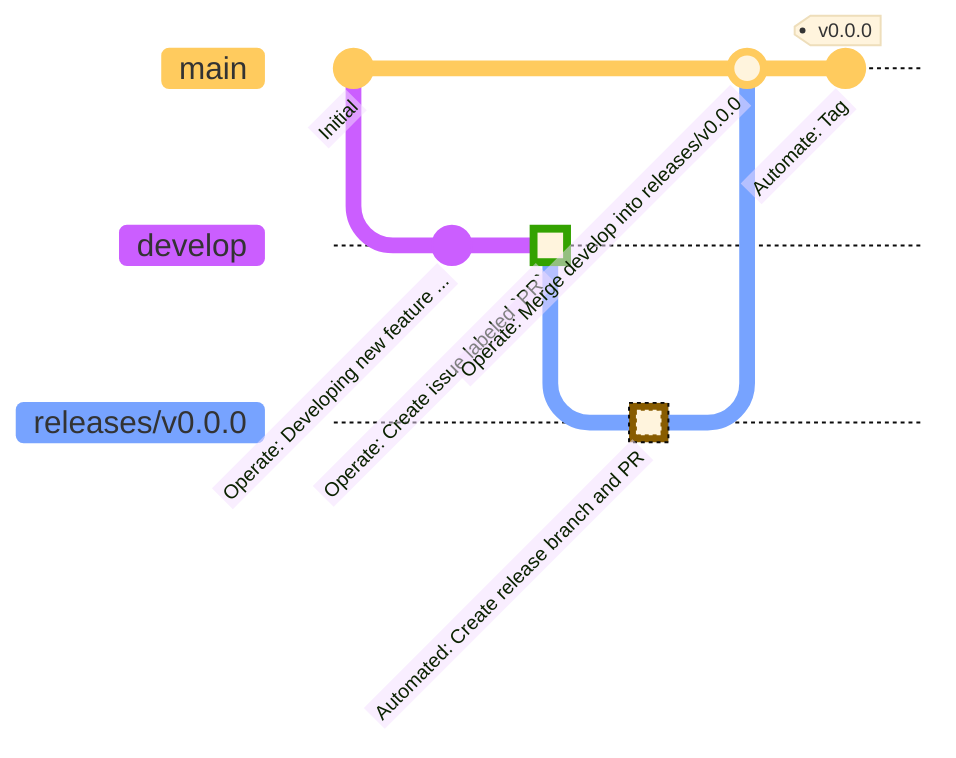

# release-workflow

## Setup

Check here

## Overview

```mermaid
---
config:
  gitGraph:
    parallelCommits: true
  logLevel: debug
  theme: base
---
gitGraph:
  commit id: "Initial"
  branch develop
  commit id: "Operate: Developing new feature ..."
  commit id: "Operate: Create issue labeled `PR`" type: HIGHLIGHT
  branch releases/v0.0.0
  commit id: "Automated: Create release branch and PR" type: HIGHLIGHT
  checkout main
  merge releases/v0.0.0 id: "Operate: Merge develop into releases/v0.0.0"
  commit id: "Automate: Tag" tag: "v0.0.0"
```
